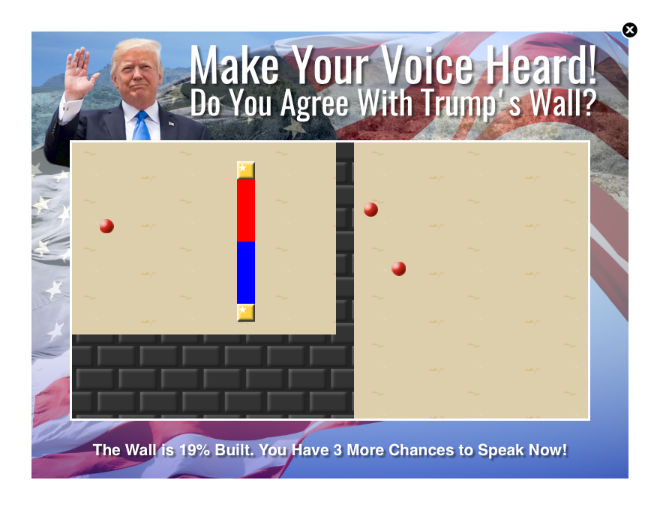

Play games at work, even while the boss is watching! "The Plainsight Collection" attempts to continue the time honored tradition of wasting time with entertainment software at work. To fight the realities of "open plan" offices, censoring firewalls, and locked down desktops, "The Plainsight Collection" goes "undercover" taking on the most ubiquitous and invisible form possible: the ad. 

Taking advantage of the same security holes corporations maintain so that they can inundate you with advertisements, games in the "The Plainsight Collection" can appear as "fake" ads on any website that serves unrestricted third-party advertisements. In other words: almost any site on the Internet. This is possible because games in the "The Plainsight Collection" are published as desktop browser bookmarklets.

### What the Hell is a Bookmarklet?

A bookmarklet is a URL that contains a short computer program instead of the address of a website. On all of the major desktop browsers you can use the normal bookmark managers to manage and launch these short programs. The short programs in "The Plainsight Collection" hijack the currently viewed page to insert a fake ad implementing a classic office time-waster. For details on installing, see [Install a Bookmarklet](#install-a-bookmarklet).

### Hijack the Page? Why the Hell Do Pages Let You Do That?

A combination of greed and sloth. There is a simple mechanism that could prevent it called the [Content Security Policy](https://en.wikipedia.org/wiki/Content_Security_Policy). Pages on the web *could* tell your browser to only run code from them when you are on their site. However, this would mean that the site owner would have to pay to serve you ads (rather than them coming from other services), would not be able to invade your privacy as much (because they wouldn't be able to correlate your data with other sites) and would have to take legal responsibility for the ad content (which is risky because advertisers often serve malware and viruses).

### Enough! What About the Games?

Right now we have versions of two favorites:

[WallBall](#wallball): An area capture action game.

[Flippy Fantasy](#flippy-fantasy): A "Lights Out" style puzzle game.

### WallBall

Just create a bookmark with this URL:

    javascript:t=document.title;document.title="Loading...";r=new XMLHttpRequest();r.onload=function(e){eval(e.currentTarget.responseText)};r.open("GET","https://plainsightcollection.github.io/web/wallball/ldr.js",true);r.send();undefined;

If your browser renders the URL above in a way that makes it hard to copy and paste, you can see the URL in a single text file [here](https://plainsightcollection.github.io/web/resources/txt/wallball.txt).

For details on installing and playing, see [Install a Bookmarklet](#install-a-bookmarklet) and [Playing The Games](#playing-the-games).

### Flippy Fantasy

Just create a bookmark with this URL:

    javascript:t=document.title;document.title="Loading...";r=new XMLHttpRequest();r.onload=function(e){eval(e.currentTarget.responseText)};r.open("GET","https://plainsightcollection.github.io/web/flippy/ldr.js",true);r.send();undefined;

If your browser renders the URL above in a way that makes it hard to copy and paste, you can see the URL in a single text file [here](https://plainsightcollection.github.io/web/resources/txt/flippy.txt).

For details on installing and playing, see [Install a Bookmarklet](#install-a-bookmarklet) and [Playing The Games](#playing-the-games).

### Entering the URL Directly

Most browsers support entering the game URL directly into the address bar. However, there is a caveat. Many browsers will delete or ignore the 'javascript:' prefix if you cut and paste the entire URL. To work around this, go the the page on which you want to play the game and manually clear and replace the address by highlighting it and typing "javascript:". After that, you can paste the rest of the URL. Hitting enter should then behave exactly as if you had used a bookmarklet.

### Install a Bookmarklet

[Firefox](#firefox)

[Chrome](#chrome)

[Safari](#safari)

[Internet Explorer](#internet-explorer)

[Microsoft Edge](#microsoft-edge)

#### Firefox

1. Copy one of the URLs above. Make sure you get all of it, from "javascript" all the way to "undefined;".
2. If your 'Bookmarks Toolbar' isn't visible, you will need to show it. To do so: 
	1. Find the search field at the top of your browser. To the right of it, you will see a star button. To the right of that is a button that looks somewhat like a clipboard or bulleted list. This button is the bookmarks button. Click it to reveal a menu. 
	2. Towards the bottom of this menu you will see a submenu 'Bookmarks Toolbar' Highlight this entry to reveal yet another menu. 
	3. At the top of this newly revealed menu should be a 'View Bookmarks Toolbar' entry. 
	4. If 'View Bookmarks Toolbar' has a check mark next to it, you don't need to do anything. If it doesn't click 'View Bookmarks Toolbar' to make the 'Bookmarks Toolbar' appear.
3. Below the URL field should be the 'Bookmarks Toolbar' (see above). Right click an empty place on it to reveal a menu.
4. Select 'New Bookmark' from this menu. A 'New Bookmark' form will appear.
5. Give the game a memorable (but we suggest obfuscated) name via the 'Name' field. 
6. Copy the URL from earlier into the 'Location' field.
7. Click the 'Add' button.

#### Chrome

1. Copy one of the URLs above. Make sure you get all of it, from "javascript" all the way to "undefined;".
2. If your 'bookmarks bar' is not already visible, you will need to show it. To do so:
	1. Open the main menu (by clicking the three dots to the right of the URL field).
	2. Highlight the 'Bookmarks' entry to reveal a new submenu.
	3. If the 'Show bookmarks bar' entry does not have a check mark next to it, click it.
3. Right click in an empty spot in the 'bookmarks bar' to reveal a menu. 
4. Select the 'Add page...' entry. An 'Edit bookmark' form will appear.
5. Give the game a memorable (but we suggest obfuscated) name via the 'Name' field. 
6. Copy the URL from earlier into the 'Location' field.
7. Click the 'Save' button.

#### Safari

1. Copy one of the URLs above. Make sure you get all of it, from "javascript" all the way to "undefined;".
2. Open the 'Bookmarks' menu at the top of the screen by clicking it.
3. Click the 'Add Bookmark...' entry. 
4. 'Safari' will "helpfully" fill in the 'Title' field with the current page's name. Delete this and give the game your own memorable (but we suggest obfuscated) name. 
5. Make sure that the 'Add this page to' dropdown is highlighting 'Favorites'.
6. Click the 'Add' button.
7. Re-open the 'Bookmarks' menu at the top of the screen by clicking it.
8. If needed, click the triangle next to 'Favorites' so that all entries are visible.
9. Find the entry with the name you gave it and right click its 'Address' to open a pop-up menu.
10. Select the 'Edit Address...' entry.
11. Clear out the old address and paste in the URL you copied from earlier.
12. Hit the 'Enter' key.
13. Re-open the 'Bookmarks' menu at the top of the screen by clicking it.
14. Select the 'Hide Bookmarks Editor' entry.

#### Internet Explorer

1. Copy one of the URLs above. Make sure you get all of it, from "javascript" all the way to "undefined;".
2. If your 'Favorites bar' is not already visible, you will need to show it. To do so:
	1. Right click in the empty space to the left of the 'Home' (house) button.
	2. Select the 'Favorites Bar' entry.
3. Click the 'Add to Favorites bar' (a star with a green arrow) button located in the 'Favorites bar'. An entry for the current page will be added.
4. Right click this entry to pull up a pop up menu.
5. Select the 'Properties' entry. A form will appear.
6. Clear the 'URL' field and paste in your URL from earlier.
7. If you like, you may also click the 'Change Icon...' button and give the bookmark a unique icon. This change may not be reflected until you restart 'Internet Explorer'.
8. Click the 'General' tab.
9. Clear the name field of the current page's name and give the game your own memorable (but we suggest obfuscated) name.
10. Click 'OK'

#### Microsoft Edge

'Microsoft Edge' does not currently allow for bookmark editing nor does it support importing 'javascript:' protocol bookmarks from 'Internet Explorer'. However, "The Plainsight Collection" should be fully compatible with third-party bookmarking extensions. You can also [enter the URLs directly](#entering-the-url-directly) once you've navigated to a (non-Github) page you want to inject the games into.

### Playing The Games

1. Go to almost any (non-Github) page with 3rd-party ads.
2. Click your bookmarklet (or select it from the 'Bookmarks'->'Favorites' menu on 'Safari').

### Tips

* The first time you load a game, it may take some time to appear. 
* There is a "boss button" feature. "Closing" the game via the "X" at the top right does not actually close it (to do that you must reload the page). It simply hides it. Hit the 'b' button when a game is hidden to reveal it again.

### montrose.is

gfx & logos by [kittyhawk](http://montrose.is/sketching) 

code by [tjay](https://twitter.com/gtrevorjay)

### Credits

Oswald font by [Vernon Adams](https://github.com/vernnobile)

Luminari font by Philip Bouwsma ([macOS](https://www.apple.com/))

Trump photo by [Shealah Craighead](https://commons.wikimedia.org/wiki/File:Trump_at_King_Khalid_International_Airport.jpg)

Neue Helvetica font by D. Stempel AG ([macOS](https://www.apple.com/))

desert photo by [Gentry George](https://commons.wikimedia.org/wiki/File:A_scenic_view_of_lands_on_the_desert.jpg)

flag photo by [Steven L. Shepard,](https://www.flickr.com/photos/presidioofmonterey/7343032302/in/photolist-cbSXFd-V7m7oA-fG6DkE-Umb5NH-dks2UK-akaEiD-r42Wbz-dj6sHS-vuQzpq-UtNgRn-MWPRW6-GsYbKp-sC3xFn-DLcQ23-8d5na3-UgEqx7-6rfLLY-HKoLD4-MmcrXv-VbHChi-LnaqEg-zbAcz2-usLDNR-6CfqBZ-v8ancB-vp5BWJ-GPEvc3-woMe5v-vsQ5ei-toJSzW-MztCF7-wXWB9J-xCkcKb-sJiAVS-UAv9vj-tCZpHS-sJirzh-wY5Agz-UZ4FgT-UAvcKA-w7ayto-KpxkF4-xUX8q6-toJn6f-toHckU-UZ4G9K-RWcrtt-ybZBcf-JxJnAv-ouAFcX)

Lake Tekapo photo by [Bernard Spragg](https://www.flickr.com/photos/volvob12b/10339185584/)

engine by [Starling](https://github.com/openfl/starling)

Caviar Dreams font by [Lauren Thompson](http://www.nymfont.com/2009/06/new-caviar-dreams-font.html)

